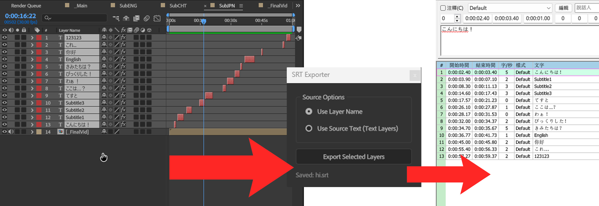

# After Effects Layer to SRT Exporter

A dockable ScriptUI panel for Adobe After Effects that exports selected layers to the SubRip (.srt) subtitle format.

## Features

- **Dockable Interface:** Runs as a native panel within the After Effects workspace.
- **Chronological Sorting:** Automatically sorts selected layers by their in-point time, regardless of layer index.
- **Content Modes:**
  - *Source Text:* Extracts text content from Text Layers (preserves line breaks).
  - *Layer Name:* Uses the layer name as the subtitle content (useful for blocking or non-text layers).
- **Formatting:** Exports standard UTF-8 encoded .srt files.

## Installation

1. Download `Yan-K_ExportSRT.jsx`.
2. Move the file to the **ScriptUI Panels** folder:
   - **Windows:** `C:\Program Files\Adobe\Adobe After Effects [Version]\Support Files\Scripts\ScriptUI Panels\`
   - **macOS:** `/Applications/Adobe After Effects [Version]/Scripts/ScriptUI Panels/`
3. Restart After Effects.
4. The script will appear under the **Window** menu (e.g., **Window > Yan-K_ExportSRT.jsx**).

## Usage

1. Open a composition and select the layers intended for export.
2. Open the panel via **Window > Yan-K_ExportSRT**.
3. Select the content source:
   - **Use Layer Name:** Uses the name of the layer in the timeline.
   - **Use Source Text:** Uses the actual text value (requires Text Layers).
4. Click **Export Selected Layers**.
5. Save the resulting .srt file.

## Notes

- **Line Breaks:** The script automatically converts After Effects carriage returns (`\r`) into standard subtitle newlines (`\n`).
- **Fallback:** If "Use Source Text" is selected but a layer is not a text layer, the script defaults to using the Layer Name to prevent errors.

## License

Distributed under the CC0 License. See `LICENSE` for more information.
